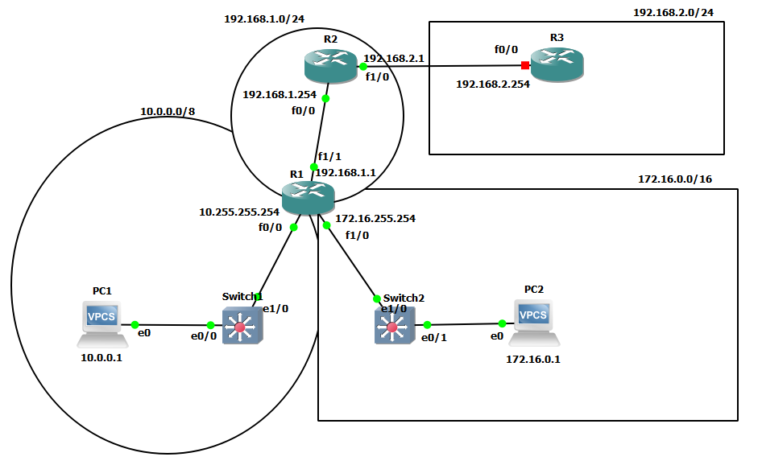

Switch **flood** frames with unknown dst. (dst. not in MAC address table)
Router **drop** packets with unknown dst. (dst. not in routing table)



gateway of last resort - defaul gateway on Cisco
default route - least specific possible route (matches all possible dst.)
	IP address:
	0.0.0.0/0 (IP address 0.0.0.0, mask 0.0.0.0)

`ip route DST_ADDRESS DST_MASK NEXT_HOP`
e.g. `ip route o.o.o.o o.o.o.o 192.168.1.254` - set route (here - default route) to 192.168.1.254 (here - gateway of last resort)

or `ip route DST_NET_ADDRESS DST_MASK EXIT_INTERFACE` set route to an interface -> it will appear
e.g. `ip route 192.168.2.0 255.255.255.0 g0/0`

`do show ip route`
```
R1(config)#ip route 0.0.0.0 0.0.0.0 192.168.1.254    -> static default gateway
R1(config)#ip route 192.168.2.0 255.255.255.0 fa1/1  -> static route through interface
R1(config)#ip route 192.168.2.0 255.255.255.0 192.168.1.244  -> intresting entry !!!!!!!!
R1(config)#do show ip route
Codes: L - local, C - connected, S - static, R - RIP, M - mobile, B - BGP
       D - EIGRP, EX - EIGRP external, O - OSPF, IA - OSPF inter area
       N1 - OSPF NSSA external type 1, N2 - OSPF NSSA external type 2
       E1 - OSPF external type 1, E2 - OSPF external type 2
       i - IS-IS, su - IS-IS summary, L1 - IS-IS level-1, L2 - IS-IS level-2
       ia - IS-IS inter area, * - candidate default, U - per-user static route
       o - ODR, P - periodic downloaded static route, H - NHRP, l - LISP
       + - replicated route, % - next hop override

Gateway of last resort is 192.168.1.254 to network 0.0.0.0

S*    0.0.0.0/0 [1/0] via 192.168.1.254
      10.0.0.0/8 is variably subnetted, 2 subnets, 2 masks
C        10.0.0.0/8 is directly connected, FastEthernet0/0
L        10.255.255.254/32 is directly connected, FastEthernet0/0
      172.16.0.0/16 is variably subnetted, 2 subnets, 2 masks
C        172.16.0.0/16 is directly connected, FastEthernet1/0
L        172.16.255.254/32 is directly connected, FastEthernet1/0
      192.168.1.0/24 is variably subnetted, 2 subnets, 2 masks
C        192.168.1.0/24 is directly connected, FastEthernet1/1
L        192.168.1.1/32 is directly connected, FastEthernet1/1
S     192.168.2.0/24 [1/0] via 192.168.1.244
                     [1/0] via 192.168.1.0
                     is directly connected, FastEthernet1/1

```
	S* - static route i.e configured manually
		* - "candidate" default route (here it was selected)
		even tho last entry "is directly connected" it could be a part of bigger route.
		fa1/1 got substituted by IP address bcos there is definition of where this interface goes to in other route
		if there was only route through 192.168.1.244 -> router would look for most specific match in routing table -> send packet through 192.168.1.0/24 route
	C - connected route - network the interface is connected to
	L - local route - actual IP address of the interface connected to (with mask /32)

"**most specific matching route**" - longest matching prefix length ( /32 > /24 > /16 > /8 > /0)
	e.g. ping 192.168.4.1
```
192.0.0.0/8 via 192.168.13.3
192.168.4.0/24 directly connected, GigabitEthernet0/0
192.168.4.1/32 via 192.168.14.4
```
	most specific: 192.168.4.1 via 192.168.14.
**Remember to check where the bits of each address fall.**
	Sometimes two /24s do not fit into a single /23, instead one sits in one /23 and the other sits in a following /23
	e.g. 192.168.1.0/24 and 192.168.2.0/24 do not fit into a single /23
	(first bit of first bit won't be a part of "new subnet" net ID)

one-way reachability - in static IP routing you have to pass routing tables T1->T2 and T2 -> T1