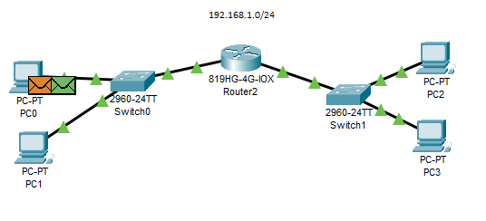

NOT FINISHED STP & DTP

PC0 (192.168.1.1) want to ping PC4 (192.168.1.4)

PC0: (-> ARP request)
1. (L3) ping process starts the `next ping request`
   ping process `create ICMP echo request message` & sends it to lower process -> src. IP address is NOT specified. Device sets it to the port's IP address
   dst. IP address is in `the same subnet`. Device sets the next-hop to destination
2. (L2) next-hop IP address is a unicast
   ARP process looks it up in the ARP table -> next-hop IP `address NOT in the ARP table`. ARP process tries to send an ARP request for that IP address and `buffers this packet` -> ARP process constructs an `ARP request` (broadcast MAC address) for the target IP address -> device encapsulates the PDU into an eth. frame
3. (L1) eth. interface sends out frame

Switch0:
1. (L1) eth. interface receive frame
2. (L2) frame src. MAC address does NOT exist in the MAC table. Switch `adds a new MAC entry` to its table
   frame dst. MAC address is broadcast-> Switch processes the frame
   frame's dst. MAC address matches the **receiving port's MAC** address, the `broadcast address`, or a **multicast address** -> device decapsulates the PDU from the eth. frame -> it's an ARP frame. ARP process processes it
   active VLAN interface is NOT up. ARP process ignores the frame  ????
3. (L2) broadcast frame -> Switch sends out the frame to all ports in the same VLAN except the receiving port
4. (L1) eth. interfaces sends out frame

PC1:
1. (L1) eth. interface receive frame
2. (L2) frame's dst. MAC address matches the receiving port's MAC address, the `broadcast address`, or a multicast address -> device decapsulates the PDU from the eth. frame -> it's an ARP frame. The ARP process processes it
   ARP frame is a request -> ARP request's target IP address does not match the receiving port's IP address -> ARP process drops the frame

Router:
1. (L1) eth. interface receive frame
2. (L2) frame src. MAC address does NOT exist in the MAC table. Router `adds a new MAC entry` to its table
   frame dst. MAC address is broadcast -> Router processes the frame
   frame's dst. MAC address matches the **receiving port's MAC** address, the `broadcast address`, or a **multicast address**. -> device decapsulates the PDU from the eth. frame -> it's an ARP frame. The ARP process processes it
   active VLAN interface is not up. The ARP process ignores the frame  ????
3. (L2) broadcast frame -> Router sends out the frame to all ports in the same VLAN except the receving port
4. (L1) eth. interfaces sends out frame

Switch1: (same as Switch0 and Router)
1. (L1) eth. interface receive frame
2. (L2) frame src. MAC address does NOT exist in the MAC table. Switch `adds a new MAC entry` to its table
   frame dst. MAC address is broadcast-> Switch processes the frame
   frame's dst. MAC address matches the **receiving port's MAC** address, the `broadcast address`, or a **multicast address** -> device decapsulates the PDU from the eth. frame -> it's an ARP frame. ARP process processes it
   active VLAN interface is NOT up. ARP process ignores the frame  ????
3. (L2) broadcast frame -> Switch sends out the frame to all ports in the same VLAN except the receiving port
4. (L1) eth. interfaces sends out frame

PC2: (same as PC1)
1. (L1) eth. interface receive frame
2. (L2) frame's dst. MAC address matches the **receiving port's MAC** address, the `broadcast address`, or a **multicast address** -> device decapsulates the PDU from the eth. frame -> it's an ARP frame. The ARP process processes it
   ARP frame is a request -> ARP request's target IP address does not match the receiving port's IP address -> ARP process drops the frame

PC3: (-> ARP reply)
1. (L1) eth. interface receive frame
2. (L2) frame's dst. MAC address matches the receiving port's MAC address, the `broadcast address`, or a multicast address -> device decapsulates the PDU from the eth. frame -> it's an ARP frame. The ARP process processes it
   ARP frame is a `request` -> ARP request's target IP address `matches the receiving port's IP` address -> ARP process` updates the ARP table` with received information
3. (L2) ARP process replies to the request with the receiving port's MAC address -> device encapsulates the PDU into an eth. frame
4. (L1) eth. interface sends out frame

Switch1:
1. (L1) eth. interface receive frame
2. (L2) frame src. MAC address does NOT exist in the MAC table -> Switch `adds a new MAC entry` to its table
   unicast frame -> Switch looks in its MAC table for the dst. MAC address
3. (L2) outgoing port is an access port -> Switch sends the frame out that port
4. (L1) eth. interface sends out frame

Router: (same as Switch1)
1. (L1) eth. interface receive frame
2. (L2) frame src. MAC address does NOT exist in the MAC table -> Router `adds a new MAC entry` to its table
   unicast frame -> Router looks in its MAC table for the dst. MAC address
3. (L2) outgoing port is an access port -> Router sends the frame out that port
4. (L1) eth. interface sends out frame

Switch0: (same as Switch1 and Router)
1. (L1) eth. interface receive frame
2. (L2) frame src. MAC address does NOT exist in the MAC table -> Switch `adds a new MAC entry` to its table
   It's a unicast frame -> Switch looks in its MAC table for the dst. MAC address
3. (L2) outgoing port is an access port -> Switch sends the frame out that port
4. (L1) eth. interface sends out frame

PC1: (-> ICMP echo request)
1. (L1) eth. interface receive frame
2. (L2) frame's dst. MAC address matches the `receiving port's MAC` address, the **broadcast address**, or a **multicast address** -> device decapsulates the PDU from the eth. frame -> it's an ARP frame. ARP process processes it
   ARP frame is a `reply` -> ARP process `updates the ARP table` with received information -> ARP process `takes out buffer packets` waiting for this ARP reply
3. (L2) ARP process `sends buffer packets` waiting for this ARP reply -> device encapsulates the PDU into an eth. frame
4. (L1) eth. interface sens out frame

Switch0:
1. (L1) eth. interface receive frame
2. (L2) frame src. MAC address found in the MAC table of Switch
   It's a unicast frame -> Switch looks in its MAC table for the dst. MAC address
3. (L2) outgoing port is an access port -> Switch sends frame out that port
4. (L1) eth. interface sends out frame

Router:
1. (L1) eth. interface receive frame
2. (L2) frame src. MAC address found in the MAC table of Router
   It's a unicast frame -> Router looks in its MAC table for the dst. MAC address
3. (L2) outgoing port is an access port -> Router sends frame out that port
4. (L1) eth. interface sends out frame

Switch1:
1. (L1) eth. interface receive frame
2. (L2) frame src. MAC address found in the MAC table of Switch
   It's a unicast frame -> Switch looks in its MAC table for the dst. MAC address
3. (L2) outgoing port is an access port -> Switch sends frame out that port
4. (L1) eth. interface sends out frame

PC3: (-> ICMP echo reply)
1. (L1) eth. interface receive frame
2. (L2) frame's dst. MAC address matches the `receiving port's MAC` address, the **broadcast address**, or a **multicast address** -> device decapsulates the PDU from the eth. frame
3. (L3) packet's dst. IP address `matches the device's IP` address or the **broadcast address** -> device decapsulates the packet
   packet is an ICMP packet -> ICMP process processes it -> ICMP process received an `echo request message`
4. (L3) ICMP process replies to the echo request by setting ICMP type to echo reply -> ICMP process `sends an echo reply`
   dst. IP address is in the same subnet -> device sets the next-hop to destination
5. (L2) next-hop IP address is a unicast -> ARP process `looks it up in the ARP table`
   next-hop IP address is in the ARP table -> ARP process `sets the frame's dst. MAC` address to the one found in the table -> device encapsulates the PDU into an eth. frame
6. (L1) eth. interface sends frame

Switch1:
1. (L1) eth. interface receive frame
2. (L2) frame src. MAC address found in the MAC table of Switch
   It's a unicast frame -> Switch looks in its MAC table for the dst. MAC address
3. (L2) outgoing port is an access port -> Switch sends frame out that port
4. (L1) eth. interface sends out frame

Router:
1. (L1) eth. interface receive frame
2. (L2) frame src. MAC address found in the MAC table of Router
   It's a unicast frame -> Router looks in its MAC table for the dst. MAC address
3. (L2) outgoing port is an access port -> Router sends frame out that port
4. (L1) eth. interface sends out frame

Switch0:
1. (L1) eth. interface receive frame
2. (L2) frame src. MAC address found in the MAC table of Switch
   It's a unicast frame -> Switch looks in its MAC table for the dst. MAC address
3. (L2) outgoing port is an access port -> Switch sends frame out that port
4. (L1) eth. interface sends out frame

PC1:
1. (L1) eth. interface receive frame
2. (L2) frame's dst. MAC address matches the `receiving port's MAC address`, the **broadcast address**, or a **multicast address** -> device decapsulates the PDU from the eth. frame
3. (L3) packet's dst. IP address `matches the device's IP` address or the **broadcast address** -> device decapsulates the packet
   packet is an ICMP packet. The ICMP process processes it -> ICMP process received an echo reply message
   ping process received an `echo reply message`

****
#### Spanning Tree Protocol
switches&network bridges (Layer 2) protocol for creating loical topologies without loops.
BPDU (bridge protocol data unit) - received even on blocked ports. Use special multicast MAC address

Switch0:
1. (L2) STP process sends out a configuration BPDU -> device encapsulates the PDU into an eth. frame
   Switch unicasts the frame out to the access ports (all of them?)
2. (L1) eth. interface sends out frames

PC1&PC2:
1. (L1) eth. interface receive frame
2. (L2) frame's dst. MAC address matches the **receiving port's MAC** address, the **broadcast address**, or a `multicast address` -> device does `NOT have a service that accepts this frame` -> drops the frame

Router:
1. (L1) eth. interface receive frame
2. (L2) frame src. MAC address was found in the MAC table of Router
   frame's destination MAC address matches the **receiving port's MAC** address, the **broadcast address**, or a `multicast address` -> device decapsulates the PDU from the eth. frame
   STP process receives a BPDU on FastEthernet0
   BPDU is a `configuration BPDU` -> received BPDU contains repeated information
3. (L2) STP process `sends out a configuration BPDU` -> device encapsulates the PDU into an eth. frame
   Router unicasts the frame out to the access ports

Switch1:
1. (L1) eth. interface receive frame
2. (L2) frame src. MAC address was found in the MAC table of Switch
   frame's destination MAC address matches the **receiving port's MAC** address, the **broadcast address**, or a `multicast address` -> device decapsulates the PDU from the eth. frame
   STP process receives a BPDU on FastEthernet0/1
   BPDU is a `configuration BPDU` -> received BPDU contains repeated information
3. (L2) STP process `sends out a configuration BPDU` -> device encapsulates the PDU into an eth. frame
   Switch unicasts the frame out to the access ports

PC3&PC4:
1. (L1) eth. interface receive frame
2. (L2) frame's dst. MAC address matches the **receiving port's MAC** address, the **broadcast address**, or a `multicast address` -> device does `NOT have a service that accepts this frame` -> drops the frame

****
#### Dynamic Trunking Protocol
for the purpose of negotiating [trunking](https://en.wikipedia.org/wiki/Trunking "Trunking") on a link between two [VLAN](https://en.wikipedia.org/wiki/VLAN "VLAN")-aware [switches](https://en.wikipedia.org/wiki/Network_switch "Network switch"), and for negotiating the type of trunking [encapsulation](https://en.wikipedia.org/wiki/Encapsulation_(networking) "Encapsulation (networking)") to be used
????
DTP frame - ????

Switch1:
1. (L2) device sends out a DTP frame on FastEthernet0/3 -> device encapsulates the PDU into an eth. frame
   Switch unicasts the frame out to the access port.