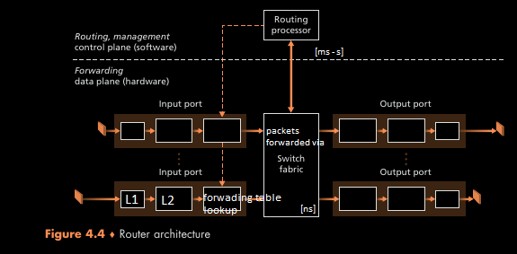

forwarding (data plane) - router-local action of transfering a packet from input link interface to appropriate output link interface
	destination-based forwarding - based on dst. IP
	generalized forwarding - based on other IP header info

routing (control plane) - network-wide process determinating end-to-end paths of packets from src to dst

traditionally `routing algorithms` (control plane ofc) are working per-router and communicationg with each other via `routing protocols`
in SDN (`software defined networking`) data & control plane are explicitly separated - control plane functions as separate servce typically in separate remote "controller"

Internet network layer provide only *best-effort service*
ATM network layer provide *guaranteed in-order delay*, *bounded delay*, *guaranteed minimal bandwidth*

#### generic router architecture

- input ports - L1 functions -> L2 functions -> packet version, checksum and TTL check & rewrite of two latter -> update of `network management` counters (e.g. IP packets received) -> forward table lookup -> queue/packet switching via `switch fabric`
- `switching fabric` - piece of hardware connecting input interface with output interface
- output ports - stores&transmits packets from `switching fabric` to outgoing links via L2&L1 functions
  if `bidirectional port` - input&output ports usually paired on the same `line card`
- routing processor - control plane functions:
	  traditional routers:
		  - execute forwarding tables
		  - maintain forward tables & attached link state info
		  - compute forwarding tables
	  SDN routers:
		  - communicating with `remote controller` (i.a. receive forwarding tables)
		  - installing forwarding table entries to input ports
there are also some other network management fctions

For **fast** forwarding sake:
- routing processor connected to input port via separate bus -> each input port has it's own shadow copy of forwarding table -> forwarding decisions are made locally, without the need for central processing each packet
- fast lookup algorithms (faster than linear)
- **low memory access times** - embedded on-chip DRAM or faster SRAM (as DRAM cache) or TCAM
	-  RAM (random access memory) - user supplies a memory address -> RAM returns the data word stored at that address.
		  "Random access" bcos data can be read/written in almost the same speed regardless of physical location on disc
		- DRAM (dynamic RAM) - `transistor&capacitor pair` as memory cell (store 1 bit)
		- SRAM (static RAM) - state of `6-transistors` as memory cell
			  faster&lower power needs than DRAM
			  low storage density
			  often used as CPU cache
	- CAM (content addressable memory) - user supplies a data word -> CAM searches its entire memory to see if that data word is stored anywhere in it
		  much faster than RAM in data search applications
		  obviously - greater size, power consumption and cost
		- Binary CAM - data search words consist of only 1's and 0's
		- TCAM (Ternary CAM) - has third matching state X == "*don't care*".
			  e.g. 10XX1 == 10001 v 10101 v 10011 v 10111
			  archived using mask bit "care"/"don't care" for every memory cell
- multiple **switching fabrics in parallel** - input and output ports connected to *N* switching fabrics. Input port sends ("sprays") chunks of packet to *K* switching fabrics of that *N*-> output port reassemble packet

Switching (forwarding) techniques:
- via `memory`:
	- old devices - switching under direct control of CPU (routing processor).
	  only 1 read/write operation a the time (shared bus system)
	- modern devices (e.g. Cisco Catalyst 8500 series)- shared memory multiprocessors with processing on the line card writing packets into the memory of appropriate output port
- via `bus` - input port prepend packet with a switch-internal label -> sends it to the bus -> packet arrives at every output port BUT only port machting the label keeps it
  shared bus system - speed of router limited to max. bus speed
  (e.g. Cisco 6500 router with 32 Gbps backplane bus)
- via `interconnection network` - instead of single, shared bus it use sophisticated interconnection network (like buses used in past to interconnect processors in multiprocessor architecture)
  `crossbar switch` is an example of such interconnection network
  switch fabric controller can open/close intersections of buses
	  packet forwarded to an output port WON'T be blocked IF there is no other packet forwarded to that output port
(e.g. Cisco 12000 use crossbar switch
Cisco 7600 can use a bus or crossbar switch)
- via `multistage switching fabric` - allow multiple packets form different input port to be forwarded to the same output port
  (e.g. Cisco CRS employs three stage non-blocking strategy)

Output port processing:
